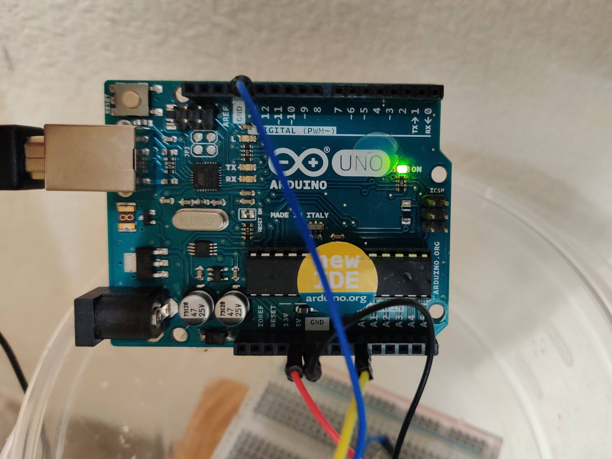
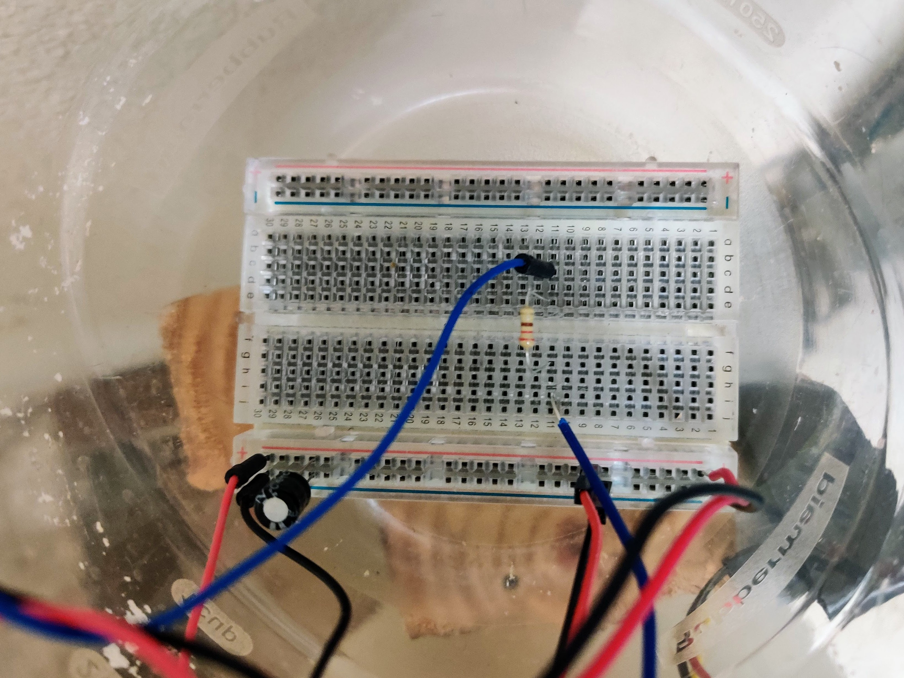
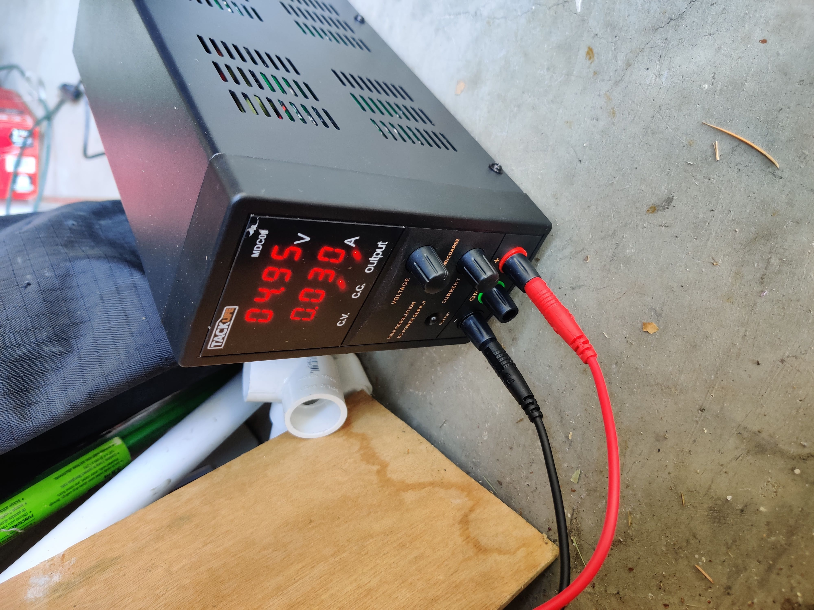
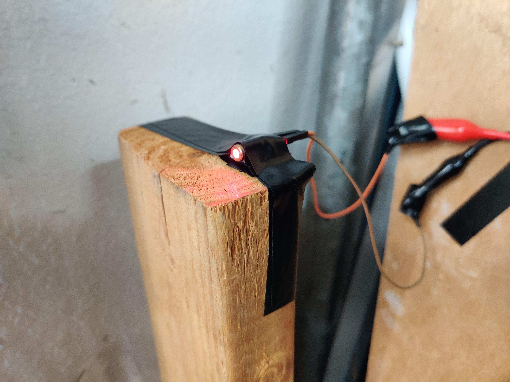
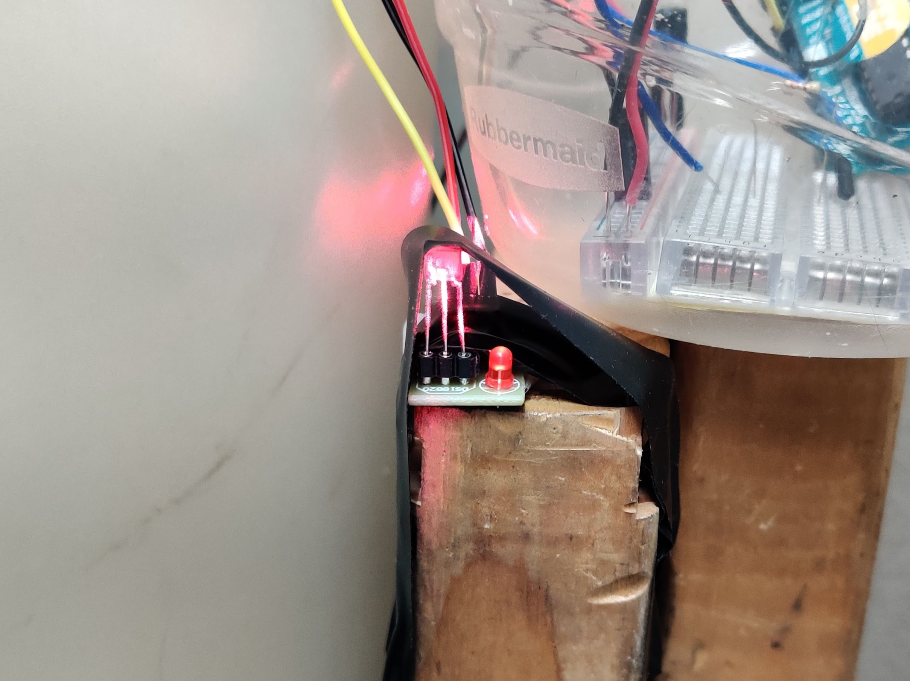
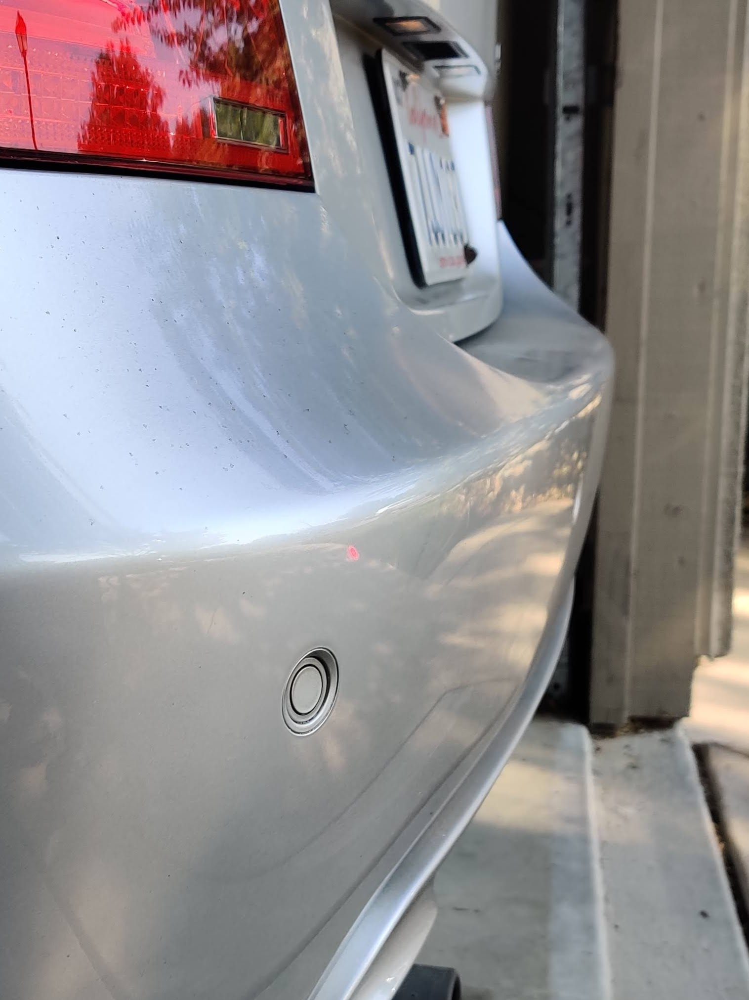
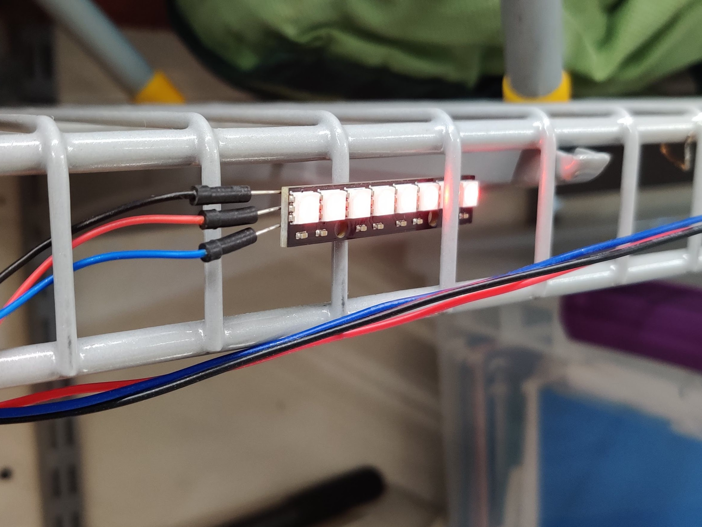
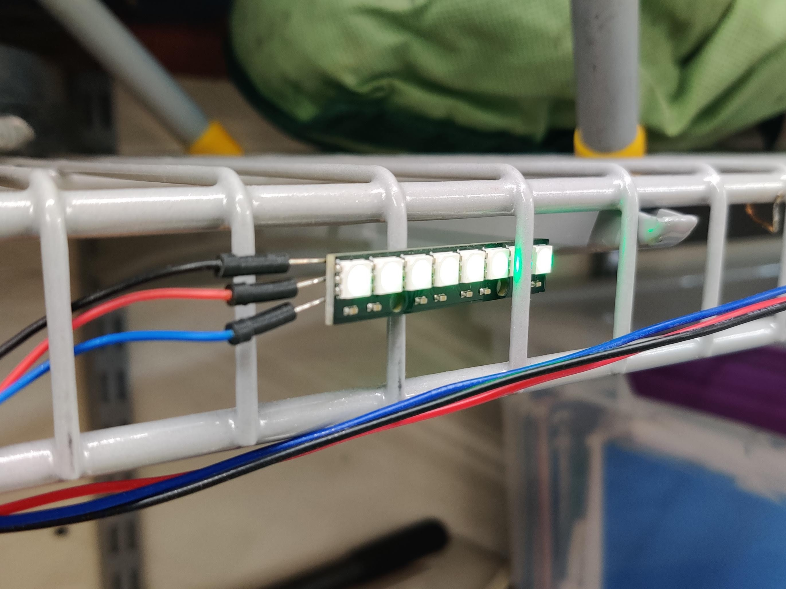

# The Arduino Garage Door Sensor
### My summer project to stop my garage door from scratching my car's bumper, once and for all.

<br>

### *Idea:*

A laser shining directly at a photoresistor is an easy way to detect whether or not an object is blocking the laser's path. Then, an LED light mounted at the front of the garage could indicate whether or not the laser beam is interrupted. If the LED is red, I my bumper is in the way of the garage door, but if the LED is green, the garage door can close without damaging my bumper.

<br>

### *Materials:*
<li> Arduino Uno microntroller
<li> A breadboard
<li> 22 guage wire
<li> LED strip with 8 RGB LED's
<li> Laser transmitter module
<li> Laser receiver module

<br>

### *Tools*
<li> Soldering iron
<li> Solder
<li> Wire strippers
<li> Electrical tape

<br>

### *Implementation*
I began by wiring the LED, the laser, and the laser sensor to the Arduino through the breadboard. I initially used shorter wires that are easier to work with. This circuit utilizes a 100 microfarad capacitor and a 220 ohm resistor to protect the components.

<br>





With the circuit setup and the LED soldered, I was able to program the Arduino through the Arduino IDE. 

``` 
#include "FastLED.h"
#define sensor 0       
#define numLeds 8
#define dataPin 13
        
CRGB leds[numLeds];

void setup() {
  // put your setup code here, to run once:
  Serial.begin(9600);
  FastLED.addLeds<NEOPIXEL, dataPin>(leds, numLeds); 
  FastLED.setBrightness(10);
  leds[1] = CRGB::Green;
  FastLED.show();
  delay(2000);
}

void loop() {
  // put your main code here, to run repeatedly:
  short Detect = analogRead(sensor);
  Serial.println(analogRead(sensor));
  
  if(Detect < 700) {
    for(int i = 0; i < numLeds; i++) {
      leds[i] = CRGB::Red;
      }
      FastLED.show();
    }

  if(Detect >= 700) {
    for(int i = 0; i < numLeds; i++) {
      leds[i] = CRGB::Green;
      }
    FastLED.show();
    }
}
```

Initially, my program assigns necessary variables, such as the pins on the Arduino where input is received from the modules. Communication is then established between the Arduino and its modules, and the LED is setup using [FastLED library](https://fastled.io/).

Then, the Arduino begins to continuously read inputs from laser sensor. If the input is less than 700, the laser beam is not shining on the sensor and has been interrupted, so the LED turns red. If the input is over 700, the laser is shining on the sensor, and the LED turns green.

<br>

### *Installatino in the Garage*
The LED had to be mounted approximately 19 feet from the Arduino, so I soldered it to a set of longer wires. 

The laser emitter needed to be placed on the other side of the garage door, and wire across the ceiling would have added up to about 30 feet, so I attached the emitter to its own power source across the garage. I set the PSU to supply 5 volts at 30 milliamperes, per the specifications of the laser emitter.



<br>
The point of my bumper protruding the farthest is 2 feet from the ground, so I placed 2-foot 2x4 planks of wood by the garage door rails from which I could mount the laser emitter and the laser sensor. I used plenty of electrical tape in order to secure my components in place.

<br>





<br>

### *Operation*

The laser beam is interrupted my car's bumper:



So, the LED shows red:



I pull my car further into the garage, and it is no longer interrupting the laser from shining on the sensor. So, the LED shows green.



No more scratches on the bumper!

<br>

### *Future Improvements*

- A more secure mounting system
    - Electrical tape is not the best at keeping the laser pointed at a specific spot over long periods of time. The laser especially loses its aim when the operation of the garage door causes the 2x4 plank to shake slightly. 
- Turn down the sensitivity of the sensor
    - Afternoon sunlight registers at over 700 on the sensor, causing the LED to turn green even if it is interrupted. A direct laser beam tends to produce values over 900, so the code should be changed to reflect this new boundary. 


